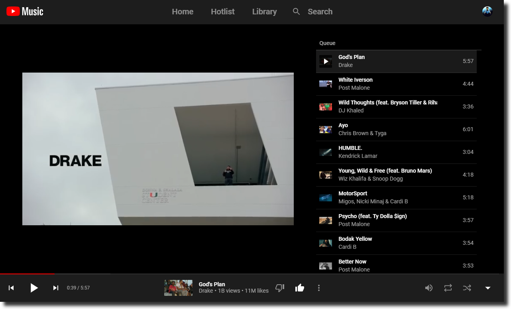
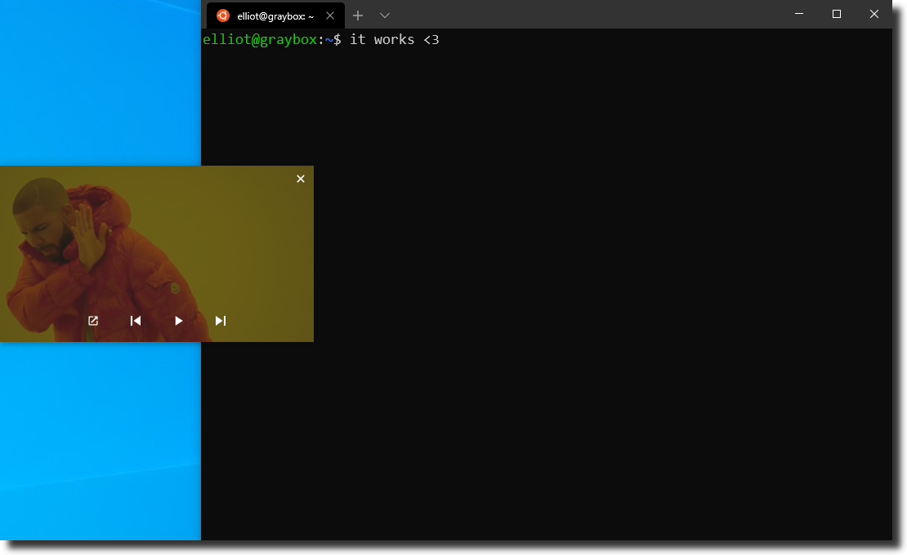

<h2 align="center">
  <br>
  <a href="https://github.com/iMro0t/youtube-music"></a>
  <br>
  YouTube Music
  <br>
</h2>

<h4 align="center">YouTube Music Desktop App</h4>

<p align="center">
  <a href="https://github.com/iMro0t/youtube-music/releases">
    
  </a>
 <a href="https://github.com/iMro0t/youtube-music/releases/latest">
    
  </a>
</p>

<br>

<a href="https://github.com/iMro0t/youtube-music/releases/latest">
	
</a>

## Highlights

- [Picture In Picture Mode](#picture-in-picture-mode)
- [Keyboard shortcuts](#keyboard-shortcuts)
- Silent auto-updates

## Install

_Currently Windows 7+ is supported (64-bit only)._

### Windows

[**Download**](https://github.com/iMro0t/youtube-music/releases/latest) the `.exe` file.

## Features

### Picture In Picture Mode

You can toggle Picture In Picture Mode in the `File` menu or with <kbd>CTRL</kbd> <kbd>p</kbd>.

<br>

<a href="https://github.com/iMro0t/youtube-music/releases/latest">
	
</a>

### Keyboard shortcuts

#### Playback

| Description                 | Keys                                                                        |
| --------------------------- | --------------------------------------------------------------------------- |
| Play/Pause                  | <kbd>SPACE </kbd>or <kbd>; </kbd>                                           |
| Mute                        | <kbd>m</kbd>                                                                |
| Shuffle Queue               | <kbd>s</kbd>                                                                |
| Toggle Repeat None/Once/All | <kbd>r</kbd>                                                                |
| Previos song                | <kbd>k</kbd> or <kbd>SHIFT</kbd><kbd>p</kbd>                                |
| Next song                   | <kbd>j</kbd> or <kbd>SHIFT</kbd><kbd>n</kbd>                                |
| Volume Up                   | <kbd>=</kbd>                                                                |
| Volume Down                 | <kbd>-</kbd>                                                                |
| Forward 10s                 | <kbd>l</kbd> or <kbd>SHIFT</kbd><kbd>→</kbd>                                |
| Back 10s                    | <kbd>h</kbd> or <kbd>SHIFT</kbd><kbd>←</kbd>                                |
| Forward 1s                  | <kbd>SHIFT</kbd><kbd>l</kbd> or <kbd>CTRL</kbd><kbd>SHIFT</kbd><kbd>→</kbd> |
| Back 1s                     | <kbd>SHIFT</kbd><kbd>h</kbd> or <kbd>CTRL</kbd><kbd>SHIFT</kbd><kbd>←</kbd> |

#### General

| Description          | Keys                           |
| -------------------- | ------------------------------ |
| Toggle PIP Mode      | <kbd>CTRL</kbd> <kbd>p</kbd>   |
| Toggle Full Screen   | <kbd>F11</kbd> or <kbd>f</kbd> |
| Mute                 | <kbd>m</kbd>                   |
| Volume Up            | <kbd>=</kbd>                   |
| Volume Down          | <kbd>-</kbd>                   |
| Toggle player        | <kbd>q</kbd> or <kbd>ESC</kbd> |
| Like current song    | <kbd>+</kbd>                   |
| Dislike current song | <kbd>\_</kbd>                  |

#### Navigation

| Description    | Keys                          |
| -------------- | ----------------------------- |
| Go to Home     | <kbd>gh</kbd>                 |
| Go to Hotlist  | <kbd>gt</kbd> or <kbd>f</kbd> |
| Go to Library  | <kbd>gl</kbd>                 |
| Go to Settings | <kbd>g,</kbd>                 |
| Search         | <kbd>/</kbd>                  |

## Dev

Built with [Electron](https://electronjs.org).

### Run

```
$ npm install && npm start
```

### Build

See the [`electron-builder` docs](https://www.electron.build/multi-platform-build).

### Publish

```
$ npm run release
```

Then edit the automatically created GitHub Releases draft and publish.

## Disclaimer

This is a third-party app and is not affiliated with YouTube of Google.
